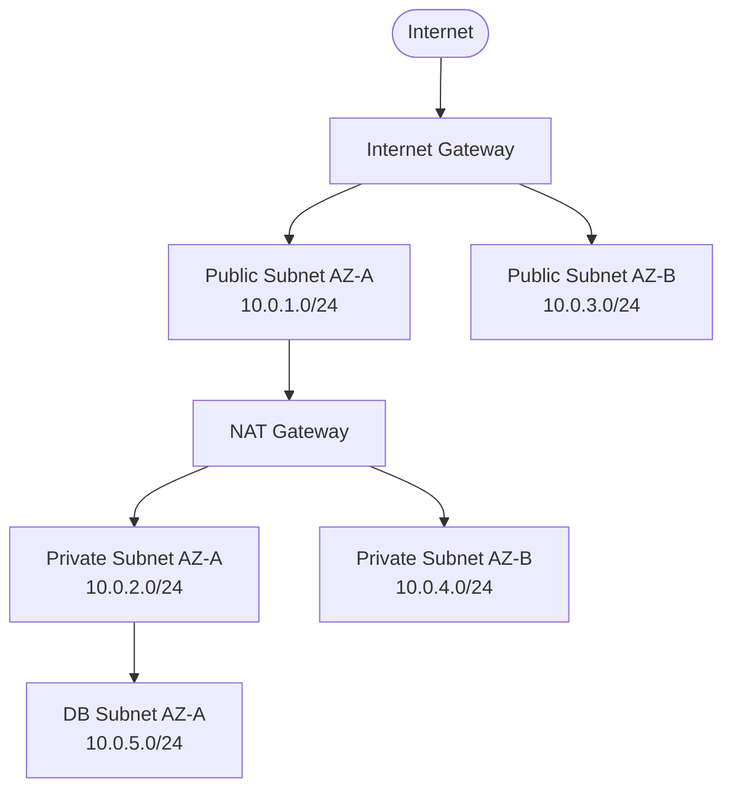
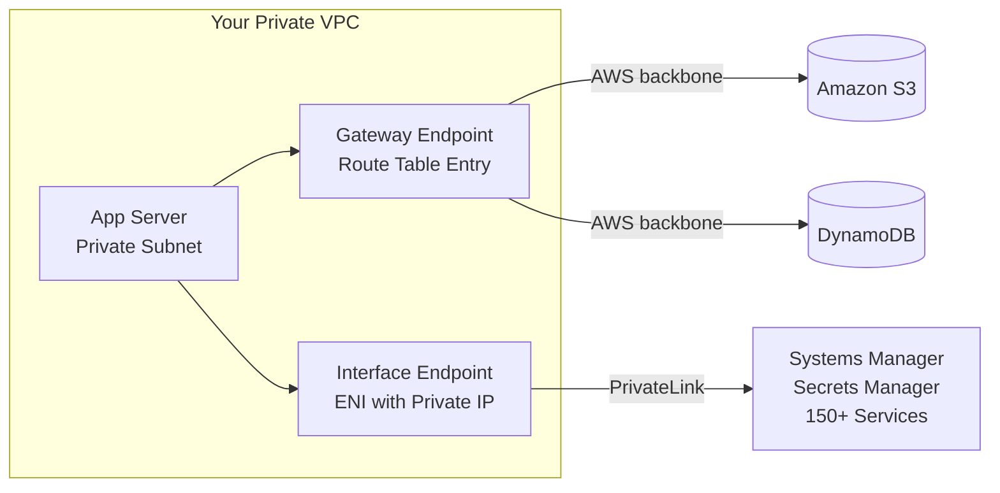
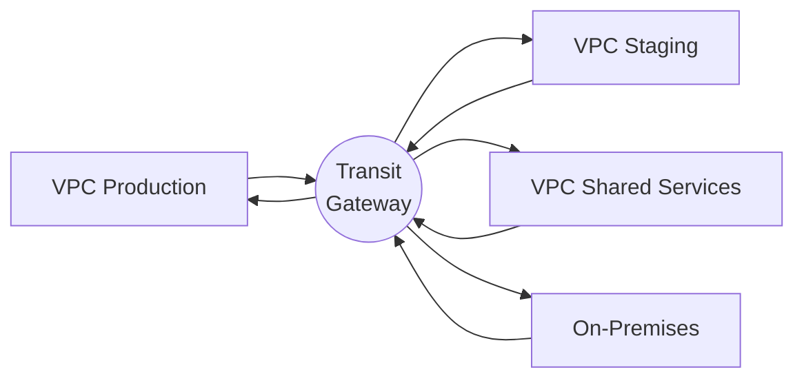

# AWS VPC: Your Private Corner of the Cloud

Build isolated, secure, and highly connected networks on AWS

<!--
Hey everyone! Welcome! Today we are going to learn something REALLY cool.

Have you ever built a house out of Lego bricks? You pick where the rooms go, where the doors are, and who is allowed inside, right?

Well today, we are going to build a house - but on the INTERNET! And this house is called a VPC.

By the end of today, YOU will know how to build your very own private house on Amazon's giant cloud. You will know how to put rooms in it, lock the doors, and even build roads to connect it to other houses.

Sounds fun? Let's go!
-->

---
layout: section
icon: fa-solid fa-city
---

# What is a VPC?

<!--
Okay, before we start building, let's understand WHY we need a VPC.

Imagine Amazon Web Services is like a HUGE city - like a really really big city with thousands of buildings.

When you use AWS, you are sharing that city with thousands of other companies. Banks, schools, game companies, hospitals - they all use AWS too.

But here is the problem: you do NOT want the bank's computers talking to your computers, right? That would be like sharing your bedroom with a stranger! Scary!

So Amazon says: "Hey, we will give you your OWN private neighborhood inside our city. No strangers allowed. Only YOU control who comes in and out."

That private neighborhood is called a VPC - Virtual Private Cloud.

"Virtual" means it exists in software, not a real physical place.
"Private" means only you can use it.
"Cloud" means it lives on Amazon's computers.

Cool right? Let's go deeper!
-->

---
layout: default
---

## Think of AWS Like a City

**AWS** is a massive shared global infrastructure. A **Virtual Private Cloud (VPC)** is your own fenced-off private neighborhood within it - completely isolated from other tenants.

- Logically isolated section of the AWS cloud dedicated entirely to your account
- Full control over IP addressing, routing, subnets, and security policies
- Spans all Availability Zones within a single AWS Region
- Every AWS account gets a **default VPC** per region - ready to launch instantly

<!--
Let's use the city picture to understand this perfectly.

Imagine AWS is like New York City - a MASSIVE city with millions of buildings.

Your VPC is like your own gated community inside that city. Think of those neighborhoods with a big fence all around them and a security guard at the gate. People from outside CANNOT just walk in.

Inside your gated community:
- You decide where the streets are (those are called subnets)
- You decide who can enter (those are called security rules)
- You decide how big the neighborhood is (that is called a CIDR block)
- You are the BOSS of everything inside!

Here is the really cool part: even though thousands of other people are using AWS at the same time, they CANNOT see your stuff and you CANNOT see their stuff. It is like everyone has their own invisible fence!

Now, "logically isolated" sounds like a big scary phrase, but it just means: software creates a wall between you and everyone else. You are sharing the same physical computers with others (just like how you share a school building with other classes), but your work is completely separate from theirs.

The DEFAULT VPC is like when you first move into a city and the landlord has already furnished a basic apartment for you. Everything is set up so you can start immediately! But as you get more experienced, you want to design your own custom home. That is what professionals do.
-->

---
layout: points-4
heading: VPC Core Concepts
points:
  - title: Region
    description: VPCs live in a single AWS Region. Each region has 2-6 Availability Zones for redundancy and fault tolerance.
    faIcon: fa-solid fa-globe
  - title: CIDR Block
    description: The IP address range for your VPC. A /16 gives 65,536 addresses. Plan ahead - adding secondary CIDRs is possible but messy.
    faIcon: fa-solid fa-network-wired
  - title: Availability Zones
    description: Physically isolated data center clusters within a region. Subnets live in a single AZ. Spread subnets across AZs for high availability.
    faIcon: fa-solid fa-building
  - title: Default VPC
    description: AWS pre-creates one default VPC per region with public subnets, an IGW, and route tables so you can launch resources immediately.
    faIcon: fa-solid fa-star
---

<!--
Before we build anything, we need to learn 4 important words. Think of these like the rules of the game before you start playing!

WORD 1 - REGION:
Imagine Amazon has big computer buildings all over the world. In India. In America. In Germany. In Japan. Each of these locations is called a "Region."

Your VPC lives in ONE region. If you make a VPC in Mumbai (India), it stays in Mumbai. It does not automatically go to America too.

Think of it like this: your school is in your city, not in every city in the world. Right?

WORD 2 - CIDR BLOCK:
This is just a fancy way of saying "how many IP addresses do you want?"

An IP address is like a house number. Every computer needs one so people know where to send messages.

A /16 CIDR block gives you 65,536 addresses. That is like having house numbers 1 to 65,536! Plenty of room for all your computers.

The bigger the number after the slash, the SMALLER your range. /16 is BIG. /28 is TINY (only 16 addresses).

WORD 3 - AVAILABILITY ZONES:
Remember how I said Amazon has big computer buildings? Well inside one region, there are MULTIPLE buildings! These are called Availability Zones.

Why? Because buildings can catch fire. Pipes can burst. Power can go out.

If you put your computers in ONLY ONE building and it has a problem - your website goes down! Oops!

So smart people put their computers in 2 or 3 different buildings. If one building has a problem, the other buildings keep everything running! This is called "high availability."

WORD 4 - DEFAULT VPC:
When you first sign up for AWS, Amazon is very kind. They create a VPC for you automatically in every region! This is the Default VPC.

It is like how your phone comes with some apps already installed. You did not set them up, but they are there and work. Great for learning!

But for real production work, you always create your OWN custom VPC. Just like how you customize your phone with your own apps and wallpaper.
-->

---
layout: section
icon: fa-solid fa-sitemap
---

# Subnets and IP Addressing

<!--
Okay! We have our neighborhood (VPC). Now we need to build the ROOMS inside it!

In a real house, you have a kitchen, a bedroom, a bathroom. Each room has a different purpose.

In a VPC, the rooms are called SUBNETS. And just like rooms, each subnet has a different purpose.

Let's learn about the three types of rooms you can have in your VPC house!
-->

---
layout: points-3
heading: The Three Subnet Types
points:
  - title: Public Subnet
    description: Has a route pointing to an Internet Gateway. Resources can have public IPs and receive inbound internet traffic. Use for load balancers and bastion hosts only.
    faIcon: fa-solid fa-earth-americas
    flat: true
  - title: Private Subnet
    description: No direct internet route. Resources initiate outbound traffic through a NAT Gateway. Ideal for application servers, microservices, and internal APIs.
    faIcon: fa-solid fa-lock
    flat: true
  - title: Isolated Subnet
    description: Zero internet access - neither inbound nor outbound. Used for highly sensitive workloads like HSMs, air-gapped databases, and strict regulatory compliance zones.
    faIcon: fa-solid fa-shield-halved
    flat: true
---

<!--
Think of your VPC like a real house. It has different types of rooms and they each have different security levels.

TYPE 1 - PUBLIC SUBNET (the living room):
The living room is right near the front door. When guests come over, they sit in the living room first. Anyone from outside can come in and you can see the street from the window.

In your VPC, the public subnet is like this. Computers in the public subnet CAN be reached from the internet AND can reach the internet. They have a "public address" (like your house number on the street).

But just like you would not keep your diary or piggy bank in the living room (strangers might see it), you do NOT put your important app servers or databases here. Only your "front door" services go here - like load balancers (which share your website traffic with multiple servers).

TYPE 2 - PRIVATE SUBNET (the bedroom):
Your bedroom is NOT visible from the street. Guests cannot just walk in. But YOU can still go outside (like going to school) - you just go through the front door to get out.

In your VPC, the private subnet is like this. Computers here CANNOT be reached from the internet (safe!), but they CAN send requests out through a special helper called a NAT Gateway (we will learn about NAT soon). Your app servers and microservices live here.

Think: 90% of your computers should be in private subnets. This is the safe zone!

TYPE 3 - ISOLATED SUBNET (the safe / vault):
This is the most locked room in the house. It is completely sealed off. Nothing comes in. Nothing goes out. Not even you leave from here!

In your VPC, isolated subnets are for your most secret, sensitive data - like bank account details, passwords, encryption keys. These computers do not need internet at all. They just sit there safely storing important data, and only other computers INSIDE your VPC can talk to them.

So the rule is: Load Balancer in public, App Server in private, Database in isolated. Three layers of protection. Like a knight wearing three sets of armor!
-->

---
layout: two-cols
heading: CIDR Blocks - Your IP Address Space
---

## IPv4 CIDR

- /16 to /28 prefix lengths (65K to 16 IPs)
- AWS reserves 5 IPs per subnet
- RFC 1918 ranges: `10.0.0.0/8`, `172.16.0.0/12`, `192.168.0.0/16`

::right::

## IPv6 CIDR

- AWS assigns /56 to VPC, /64 per subnet
- All IPv6 addresses are globally unique
- No private ranges - control access via SGs/NACLs
- Dual-stack: run IPv4 and IPv6 together

<!--
Okay, IP addresses! This sounds scary but let's make it super simple.

Every computer on a network needs an address - just like every house on a street needs a house number. Without a number, how would the postman know where to deliver letters?

An IP address is the "house number" for a computer. It looks like this: 10.0.1.5

CIDR BLOCK - YOUR PIZZA ANALOGY:
Imagine you have a pizza with 65,536 slices (that's a LOT of pizza!). This is your VPC CIDR with /16.

Now you need to share this pizza between your subnets (rooms). Each room gets a slice of pizza.
- A /24 subnet gets 256 slices of that pizza
- A /28 subnet gets only 16 slices

The bigger the number after the slash, the FEWER slices you get!
/16 = 65,536 slices (the whole pizza)
/24 = 256 slices (a medium portion)
/28 = 16 slices (just a tiny bit)

IMPORTANT - AWS EATS 5 SLICES:
In every subnet, AWS keeps 5 IP addresses for itself. It is like if you ordered a pizza and the delivery person already ate 5 slices! So a /24 subnet gives you 256 minus 5 = 251 usable addresses. Always remember this when planning!

WHY 10.0.0.0 AND NOT REGULAR INTERNET ADDRESSES?
Great question! Regular internet websites use addresses like 172.217.x.x (Google) or 104.16.x.x (Cloudflare). These are PUBLIC addresses.

For your PRIVATE network, you use PRIVATE addresses that start with 10.x.x.x, 172.16.x.x, or 192.168.x.x. These addresses are reserved for private networks and are NEVER used on the public internet. So there is no confusion between your internal computers and real websites!

IPV6 - THE NEW VERSION:
IPv4 is getting OLD. We are running out of IP addresses in the world! So they invented IPv6 which gives us a basically UNLIMITED number of addresses. AWS gives your VPC a huge chunk of IPv6 addresses automatically. The difference: all IPv6 addresses are globally unique (no private ranges), so you must be extra careful with security rules.
-->

---
layout: steps-vertical
heading: Building Your VPC Step by Step
imageTitle: VPC Build Process
imageIcon: fa-solid fa-layer-group
steps:
  - title: Create the VPC
    description: Choose your CIDR block. Cannot overlap with peer VPCs - plan carefully.
  - title: Create Subnets
    description: Divide across multiple AZs. AWS reserves 5 IPs per subnet.
  - title: Attach an Internet Gateway
    description: One IGW per VPC. Scaled, redundant, and free. Required for public internet access.
  - title: Configure Route Tables
    description: Public subnets route to IGW. Private subnets to NAT Gateway. Local routes are automatic.
  - title: Apply Security Controls
    description: Security Groups on instances (stateful) and NACLs on subnets (stateless) provide layered defense.
---

<!--
Building a VPC is like building a LEGO house! Let's go step by step.

Imagine you just bought a big empty plot of land and you want to build an amazing house on it.

STEP 1 - BUY THE LAND (Create the VPC):
First, you decide how BIG your plot of land is. This is your CIDR block. A /16 plot gives you a LOT of space to build on!

One super important rule: if you plan to connect your house to your neighbor's house later (VPC Peering), your plots CANNOT overlap. If your plot is 10.0.0.0 and your neighbor's plot is ALSO 10.0.0.0 - they are the same land! You cannot connect them without confusion.

So PLAN before you buy!

STEP 2 - DIVIDE INTO ROOMS (Create Subnets):
Your empty plot needs rooms! Divide it into public, private, and maybe isolated sections.

Smart trick: build each type of room in TWO DIFFERENT BUILDINGS (Availability Zones). That way, if Building A has a problem, Building B keeps everything running!

Remember: AWS takes 5 IP "spots" in every room for itself.

STEP 3 - INSTALL THE FRONT DOOR (Attach Internet Gateway):
Your house has no connection to the outside street yet! The Internet Gateway is like installing the main front door.

AWS fully manages this door. It never breaks. It can handle any amount of traffic. And best of all - the door itself is FREE (you only pay when people walk through it with data).

Without this door, nobody from the internet can reach your public rooms.

STEP 4 - PUT UP ROAD SIGNS (Configure Route Tables):
Road signs tell cars where to go. Route tables tell network traffic where to go.

Public rooms: "All traffic going to the internet? Go to the front door (Internet Gateway)!"
Private rooms: "All traffic going to the internet? Go through the back gate helper (NAT Gateway)!"
All rooms automatically know how to talk to each other without any signs - that is the "local route."

STEP 5 - PUT ON LOCKS (Apply Security Controls):
Now your house is built! Time to put locks on everything.

Security Groups are the locks on each individual DOOR (EC2 instance). Very smart locks - they remember who came in, so they automatically let them out.

Network ACLs are the security guards at each ROOM ENTRANCE (subnet). Old-school guards - they do NOT remember faces, so you have to tell them both who can come in AND who can go out.

Congratulations! You just built a VPC!
-->

---
layout: diagram
heading: VPC Architecture Overview
---

<!--
Look at this picture! Let's read it together like a story. Point to each part as you explain.

AT THE TOP: "The Internet" - this is the BIG internet. Every person on Earth who opens a browser is here.

THE FRONT DOOR: "Internet Gateway" - all internet traffic must go through this one door. Think of it like the main gate of your school. Every visitor must check in here.

THE TWO PUBLIC ROOMS (Public Subnet A and B): These are in TWO different buildings (AZ-A and AZ-B). Remember why we do this? If Building A has a power outage, Building B keeps running! Smart!

Your LOAD BALANCER lives here. What does a load balancer do? Imagine 100 students want to ask the teacher a question. Instead of all 100 going to Teacher A (who would get exhausted!), a helper says "first 50 go to Teacher A, next 50 go to Teacher B." That helper IS the load balancer!

THE HELPER (NAT Gateway): Sits in the public area. This is the "secret mailman" for private rooms. If a computer in a private room wants to download something from the internet, it gives the request to NAT Gateway. NAT says "I'll handle this!" It goes to the internet, gets the data, and brings it back. The internet NEVER knows the private computer exists. Just like sending a letter using your friend's return address!

THE PRIVATE ROOMS (Private Subnet A and B): Your APP SERVERS live here. They can call the internet through NAT but the internet cannot call THEM directly. Safe!

THE VAULT (DB Subnet): Your DATABASE lives here. It only talks to the app servers. Zero internet contact. The safest place in your VPC house.

Now you can see the 3-layer protection: Internet talks to Load Balancer, Load Balancer talks to App Server, App Server talks to Database. Each step goes deeper into the house and gets safer!
-->

---
layout: section
icon: fa-solid fa-route
---

# Traffic Routing

<!--
Great job so far! Your house is built.

But wait - how does traffic know WHERE to go inside your VPC? When a message arrives at the front door, how does it know "turn left for the app server" or "go straight for the database"?

This is what ROUTE TABLES do. They are like the GPS navigation system for your VPC!

Imagine you are driving in a new city. Without GPS, you would get lost! Route tables are the GPS that tells every packet of data exactly where to go.
-->

---
layout: points-3
heading: Route Tables Demystified
points:
  - title: Main Route Table
    description: Auto-created with every VPC. Default for all subnets. Permanent local route covers all VPC traffic - cannot be deleted.
    faIcon: fa-solid fa-table
    flat: true
  - title: Custom Route Tables
    description: Create per subnet type. Public gets route to IGW. Private gets route to NAT Gateway.
    faIcon: fa-solid fa-code-branch
    flat: true
  - title: Most Specific Route Wins
    description: /32 beats /24 beats /16 beats /0 default. More specific routes take priority for targeted overrides.
    faIcon: fa-solid fa-trophy
    flat: true
---

<!--
Think of a Route Table as a MAP with directions written on it. Every subnet gets a map.

THE MAIN ROUTE TABLE - The automatic map:
When you create a VPC, AWS automatically gives EVERY subnet the same basic map. This map has ONE rule written on it:

"If you want to talk to anyone INSIDE this VPC (10.0.0.0/16), stay inside and talk directly."

That's it! This one rule is why all your computers inside the VPC can talk to each other automatically. You did not set anything up - AWS did it for you.

This rule CANNOT be deleted. It is permanent. Like the rules of gravity - you cannot turn it off!

CUSTOM ROUTE TABLES - Special maps:
But the basic map is not enough! Public rooms need a different map than private rooms.

For the PUBLIC subnet map, you add one extra direction: "If you want to go to the internet (anywhere = 0.0.0.0/0), use the Internet Gateway front door."

For the PRIVATE subnet map, you add: "If you want to go to the internet, use the NAT Gateway helper."

Then you give each subnet its correct map. Public rooms get the public map. Private rooms get the private map.

THE MOST SPECIFIC ROUTE WINS - The tiebreaker rule:
What if two rules on the map match the same destination? Who wins?

Simple: the MORE SPECIFIC rule wins!

Imagine you are looking for "Pizza Shop" in your city:
- One sign says "Food is to the right" (applies to ALL food = not specific)
- Another sign says "Pizza is to the left" (applies ONLY to pizza = very specific)

You follow the pizza sign because it is more specific!

In AWS: /32 (one single IP address) beats /24 (256 addresses) beats /16 (65K addresses) beats /0 (everything).

This lets you create special exceptions. Like: "send ALL traffic to the internet EXCEPT this one IP - send THAT to my office network."
-->

---
layout: table-data
heading: Common Route Table Configurations
---

| Destination | Target | Subnet Type | Purpose |
|---|---|---|---|
| 10.0.0.0/16 | local | All | VPC-internal traffic |
| 0.0.0.0/0 | igw-xxx | Public | Full internet access |
| 0.0.0.0/0 | nat-xxx | Private | Outbound only |
| 10.1.0.0/16 | pcx-xxx | Any | VPC Peering connection |
| 0.0.0.0/0 | tgw-xxx | Any | Transit Gateway |

<!--
Let's read this table like a recipe. Each row is one instruction in the GPS.

ROW 1 - "Stay home" rule:
Destination: 10.0.0.0/16 (that's YOUR VPC's addresses)
Target: local (means "stay inside, talk directly")
This means: if a message is going to any computer inside your VPC, deliver it directly. No internet needed. Like talking to your classmate next to you instead of sending a letter!

ROW 2 - "Go to the internet" rule for PUBLIC subnets:
Destination: 0.0.0.0/0 means "everything else not listed above"
Target: igw-xxx (the Internet Gateway)
This is the rule that makes a subnet PUBLIC. Without this rule, even if a computer has a public IP address, it cannot use the internet!

ROW 3 - "Go out safely" rule for PRIVATE subnets:
Destination: 0.0.0.0/0 (same as above)
Target: nat-xxx (the NAT Gateway)
This is what makes a subnet PRIVATE. Traffic goes out through NAT, but nothing comes back in uninvited!

ROW 4 - "Talk to the neighbor's house" rule (VPC Peering):
Destination: 10.1.0.0/16 (your FRIEND's VPC addresses)
Target: pcx-xxx (a peering connection = a bridge to your friend's VPC)
This says: "if you want to reach my friend's network, use this bridge."

ROW 5 - "Go through the train station" rule (Transit Gateway):
Destination: 0.0.0.0/0
Target: tgw-xxx (Transit Gateway = a central hub connecting many VPCs)
When you have many VPCs and offices all connected through one hub, use this rule.

Fun quiz: if both Row 1 and Row 2 match a destination, which one wins? Row 1! Because 10.0.0.0/16 is MORE SPECIFIC than 0.0.0.0/0. The local traffic never accidentally goes to the internet.
-->

---
layout: section
icon: fa-solid fa-shield-halved
---

# Security - Layers of Defense

<!--
Your VPC house is built and has roads. Now it is time to PROTECT it!

Think about how you protect your house in real life. You have:
- A lock on your front door
- Maybe a fence around your yard
- Possibly a security camera

In AWS, we have two different types of security guards:
1. Security Groups - the smart bouncer at each INDIVIDUAL door
2. Network ACLs - the guard at the WHOLE NEIGHBORHOOD entrance

Let's meet them both!
-->

---
layout: two-cols
heading: Security Groups vs Network ACLs
---

## Security Groups

- **Stateful** - return traffic auto-allowed
- Instance / ENI level
- Allow rules only (no explicit deny)
- Default: deny all inbound, allow all outbound

::right::

## Network ACLs

- **Stateless** - return traffic must be explicit
- Subnet level
- Allow and Deny rules
- First match wins by rule number (lowest first)

<!--
Time for the most important comparison in all of AWS networking! Pay close attention - this confuses even experienced engineers!

SECURITY GROUPS - The Smart Bouncer:
Imagine a bouncer at a club door. This bouncer is SMART. If you have a ticket (an allow rule), you can go in. And when you want to leave, the bouncer REMEMBERS you came in, so you can go out without showing your ticket again!

This is called STATEFUL - the bouncer remembers the state of who is inside.

In AWS: if you allow someone to connect to your server on port 443 (website), the response automatically goes back. You do not need a separate "allow outbound" rule for the reply. The Security Group is smart enough to know "this reply belongs to a connection I already allowed."

Security Groups only have ALLOW rules. You say "allow this" - everything else is automatically blocked. You cannot say "block this specific IP."

NETWORK ACLs - The Old-School Guard:
Now imagine a different kind of guard. This guard stands at the entrance of your entire neighborhood. This guard is OLD SCHOOL and forgetful. They do not remember faces.

When you leave home and try to come back, the guard asks for your ID AGAIN even though you showed it this morning! "I don't remember you!" the guard says.

This is called STATELESS - the guard does not remember the state of who came through before.

In AWS: if you allow inbound traffic on port 443, you MUST ALSO allow the outbound response on ports 1024-65535. Otherwise the response gets blocked! Beginners mess this up ALL the time.

NACLs have both ALLOW and DENY rules. And rules are checked in NUMBER ORDER - rule 100 before rule 200 before rule 300.

So which do you use? BOTH! Security Groups first (most important). NACLs as an extra backup layer. Two guards are better than one!
-->

---
layout: table-data
heading: Security Group vs NACL Quick Reference
---

| Feature | Security Group | Network ACL |
|---|---|---|
| Applied at | Instance / ENI | Subnet |
| State | Stateful | Stateless |
| Rule types | Allow only | Allow and Deny |
| Rule evaluation | All rules at once | Lowest number first |
| Return traffic | Auto-allowed | Must be explicit |
| Default VPC | Deny all inbound | Allow all |

<!--
This table is your CHEAT SHEET! Let's go through every row with a simple example.

"Applied at" row:
Security Group = the lock on YOUR bedroom door. Only affects your room.
NACL = the lock at the neighborhood entrance gate. Affects EVERYONE in that neighborhood.

"State" row:
Stateful (Security Group) = a smart lock that remembers your face. Once you are inside, it knows who you are.
Stateless (NACL) = a combination lock that just checks numbers. It does not know or remember YOU.

"Rule types" row:
Security Group: "ALLOW this person in. Allow that person in." No block rules needed - if you are not on the list, you are automatically blocked.
NACL: "ALLOW person A. DENY person B. ALLOW everyone else." You can specifically block certain people!

"Rule evaluation" row:
Security Group: It reads ALL rules, then decides. Like a teacher grading a whole test before giving a grade.
NACL: It reads rules in NUMBER ORDER and STOPS at the first match. Rule 100 is checked first. If it matches, done! Rule 200 is never checked.

This means: if rule 100 says ALLOW and rule 200 says DENY for the same traffic - the traffic is ALLOWED because rule 100 matched first!

"Return traffic" row:
Security Group: automatically lets the reply through. You do not need to write a rule for it.
NACL: you MUST write a rule for the outgoing reply too. Forget it and your traffic gets silently dropped!

"Default VPC behavior" row:
Security Group defaults: deny ALL inbound (nobody gets in without a rule), allow all outbound.
Default NACL: allows everything in and out (like no guard at all - fine for learning, not for production!).
Custom NACL: blocks everything until you add rules (like a new guard who trusts nobody).
-->

---
layout: section
icon: fa-solid fa-door-open
---

# Gateways - Entry and Exit Points

<!--
Your house is built, your rooms are ready, your security is set up. Now we need DOORS!

Different types of traffic need different types of doors:
- Regular people visiting your website use the FRONT DOOR (Internet Gateway)
- Your app servers sneaking out to download updates use the SIDE DOOR (NAT Gateway)
- Your office building connects via a SECRET TUNNEL (VPN / Virtual Private Gateway)
- When you have MANY buildings to connect, you use a TRAIN STATION (Transit Gateway)

Let's meet all four!
-->

---
layout: points-4
heading: The Four Gateway Types
points:
  - title: Internet Gateway
    description: Connects your VPC to the public internet. Horizontally scaled, redundant, no bandwidth limits. One per VPC. Free to attach - pay only for data transfer.
    faIcon: fa-solid fa-earth-americas
  - title: NAT Gateway
    description: Lets private subnet resources initiate outbound internet connections without being directly reachable. Fully managed, auto-scales to 45 Gbps. Lives in a public subnet.
    faIcon: fa-solid fa-arrow-right-from-bracket
  - title: Virtual Private Gateway
    description: The AWS-side VPN termination point. Enables encrypted Site-to-Site VPN tunnels from your on-premises data center. Supports dynamic BGP routing.
    faIcon: fa-solid fa-building-lock
  - title: Transit Gateway
    description: Regional hub that interconnects multiple VPCs and on-premises networks. Replaces complex peering meshes with a simple hub-and-spoke topology.
    faIcon: fa-solid fa-star-of-life
---

<!--
GATEWAY 1 - INTERNET GATEWAY (The Main Front Door):
This is the big glass front door of your VPC building. EVERYONE who visits your website goes through here. People from the internet can come IN (to your public subnet) and your public computers can go OUT.

Super cool facts: It never breaks! It handles unlimited traffic! It is completely FREE (you only pay for data that passes through it)! AWS manages it 100% - you just create it and attach it to your VPC. One VPC = One IGW. That is the rule.

GATEWAY 2 - NAT GATEWAY (The Secret Postman):
This is like having a postman who sends letters on your behalf without revealing your home address.

Imagine your app server (in a private subnet) wants to download a software update from the internet. But your app server has a PRIVATE IP (like 10.0.2.5) that the internet does not know about!

NAT Gateway helps. Your app server says "NAT, can you download this for me?" NAT Gateway runs to the internet, gets the update, and brings it back. The internet only sees NAT's address, not your private server's address.

This means: private servers can CALL OUT to the internet, but the internet CANNOT CALL IN to private servers. One-way traffic! Great for security!

GATEWAY 3 - VIRTUAL PRIVATE GATEWAY (The Secret Tunnel to Your Office):
Companies have their own offices with their own computers. The VGW creates an encrypted tunnel (like a secret underground tunnel) between your office building and your AWS VPC.

When you set this up, your office computers can talk to your AWS servers as if they are on the same floor of the same building! All traffic through this tunnel is encrypted so no one can spy on it even if they intercept it.

GATEWAY 4 - TRANSIT GATEWAY (The Train Station):
If you have many VPCs (10, 20, 50!) and you want them ALL to talk to each other plus your office... connecting them all directly would be a MESS.

Enter Transit Gateway - the central train station! Every VPC is a train line. They all connect to the same station. Now any VPC can reach any other VPC just by going through the station. Instead of 50 direct connections (tracks everywhere!), you just have 50 connections to ONE station. Clean and manageable!
-->

---
layout: icon-grid
heading: Outbound Traffic Flow - Private Subnet to Internet
mode: flow
items:
  - title: Private Instance
    faIcon: fa-solid fa-server
  - title: Private Subnet
    faIcon: fa-solid fa-lock
  - title: NAT Gateway
    faIcon: fa-solid fa-arrow-right-from-bracket
  - title: Internet Gateway
    faIcon: fa-solid fa-door-open
  - title: Internet
    faIcon: fa-solid fa-earth-americas
---

<!--
Let's tell a STORY! Follow the journey of a tiny packet of data.

Our hero: a little packet. It lives inside an App Server in a PRIVATE subnet. The app server wants to download a Node.js update from the npm website.

THE JOURNEY:

Step 1 - Private Instance says: "I need to download something from the internet! But I only have a private IP address (10.0.2.5). The internet does not know my address!"

Step 2 - Private Subnet says: "No worries! Look at your route table map. It says: for internet traffic, go to the NAT Gateway!"

Step 3 - NAT Gateway says: "I got this! Give me your packet. I am going to put MY public IP address on it (52.90.11.22). Now the internet thinks the request is coming from ME, not from you! I'll keep a note of your private address so I can bring the reply back to you."

Step 4 - Internet Gateway says: "NAT Gateway - you have a public IP! You are allowed through the front door! Off you go to the internet!"

Step 5 - Internet (npm website): "Oh, someone from 52.90.11.22 wants to download a package. Sure! Here it is, sending back to 52.90.11.22."

THE RETURN JOURNEY:
The reply packet comes back to the Internet Gateway, goes to NAT Gateway. NAT looks at its notes and says "52.90.11.22 was a request from 10.0.2.5!" It changes the destination back to 10.0.2.5 and delivers it to the app server.

The private app server got its update! The internet never knew it existed! Magic? No - just NAT!

This whole process happens in MILLISECONDS. Every time your private server makes an internet request, this entire journey happens instantly.
-->

---
layout: section
icon: fa-solid fa-plug
---

# VPC Endpoints - Stay on the AWS Network

<!--
Quick question: when your app server in a private subnet needs to save a file to Amazon S3, where does that traffic go?

Default answer: it goes through NAT Gateway, out through the Internet Gateway, ONTO THE PUBLIC INTERNET, and then into Amazon S3's public entrance.

Wait wait wait. Your file is going from Amazon's computer... to the public internet... to Amazon's computer. That is like walking out your front door, going around the block, and coming back through the back door - to visit your own living room!

That is silly AND expensive!

VPC Endpoints let you create a PRIVATE SHORTCUT directly to AWS services without ever touching the internet. Like a private door between your bedroom and the living room!
-->

---
layout: points-2
heading: Two Types of VPC Endpoints
points:
  - title: Gateway Endpoints
    description: Free endpoints for S3 and DynamoDB only. Adds a route to your route table. Traffic stays on the AWS backbone with zero ENI or hourly cost.
    faIcon: fa-solid fa-database
    flat: true
  - title: Interface Endpoints (PrivateLink)
    description: Creates an ENI with a private IP in your subnet. Supports 150+ AWS services. Hourly charge plus per-GB data fee. Private DNS requires zero code changes.
    faIcon: fa-solid fa-network-wired
    flat: true
---

<!--
There are TWO types of shortcuts and they work in very different ways.

TYPE 1 - GATEWAY ENDPOINTS (The Free Shortcut!):
These are like a secret door in your wall that connects DIRECTLY to Amazon S3 and DynamoDB. AWS built it specially for these two services because they get SO much traffic.

How it works: AWS adds a special entry in your route table that says "for traffic going to S3, do not use the internet - use this private shortcut instead." That is it. No new computer card. No new IP address. Just one extra line in your route table.

Cost: COMPLETELY FREE! Nothing extra to pay. Zero. Nada.

So why would you NOT enable these? There is literally no reason not to! Do it right now for every VPC you create!

TYPE 2 - INTERFACE ENDPOINTS / PRIVATELINK (The Private Network Card):
This is for ALL other AWS services - like Systems Manager, Secrets Manager, CloudWatch, SQS, SNS, and 150+ more.

How it works: AWS creates a real network card (called an ENI) inside YOUR subnet with a private IP address like 10.0.2.55. When your app server wants to call Systems Manager, instead of going to the internet, it talks to this private IP address.

The really cool part: your app code does not need to change! The address "ssm.us-east-1.amazonaws.com" now resolves to your private 10.0.2.55 instead of a public IP. It just works!

Cost: A small charge per hour and per GB. Not free like Gateway Endpoints. But totally worth it for sensitive services like Secrets Manager - you do NOT want your app secrets traveling across the internet!

Production tip: Use Gateway Endpoints for S3 and DynamoDB (free!), and Interface Endpoints for any service that handles sensitive data like credentials, keys, or audit logs.
-->

---
layout: diagram
heading: VPC Endpoints Keep Traffic Private
---

<!--
Look at this picture carefully! This is the story of traffic that never leaves home.

In the middle is YOUR VPC (the purple box). Everything inside it is yours and private.

Your App Server is in the private subnet. It needs to talk to three things:
- Amazon S3 (a file storage service)
- DynamoDB (a database service)
- Systems Manager (a server management service)

WITHOUT endpoints: all three paths would go out of the purple box, through NAT Gateway, out the Internet Gateway, across the public internet, and then come back to Amazon's services. Expensive! Slow! Insecure!

WITH endpoints (as shown in the picture):

PATH 1 (Gateway Endpoint to S3 and DynamoDB):
The App Server sends traffic to S3. It hits the Gateway Endpoint - which is just a route rule. The traffic then travels along "AWS backbone" (Amazon's own private fiber cables between their services). It arrives at S3 without EVER leaving Amazon's network! See how the arrow says "AWS backbone" - that means private Amazon cables, not the public internet.

PATH 2 (Interface Endpoint to Systems Manager):
The App Server calls Systems Manager. It connects to the Interface Endpoint - which is a real network card with a private IP in your subnet. Traffic goes through PrivateLink (Amazon's private connectivity service) directly to Systems Manager.

THE KEY INSIGHT: Neither path ever leaves the purple box labeled "Your Private VPC" to go to a separate internet cloud. All traffic stays within Amazon's own network. Your data never rides the public internet!

When a security auditor asks "does your sensitive data ever cross the public internet?" - with VPC Endpoints, the answer is a confident NO!
-->

---
layout: section
icon: fa-solid fa-link
---

# VPC Peering

<!--
Your VPC is amazing! But what if you have TWO VPCs and they need to talk to each other?

For example: you have a "Production VPC" where your live website runs, and a "Shared Services VPC" where your logging servers and monitoring tools live. You need the Production VPC to send logs to the Shared Services VPC.

You cannot just type in the other VPC's IP address - they are in completely separate private networks! By default, they cannot see each other at all.

VPC Peering is the solution! It is like building a private bridge between two separate neighborhoods.
-->

---
layout: points-3
heading: Connecting Two VPCs Directly
points:
  - title: What Peering Does
    description: Private two-VPC connection using private IPs. Traffic stays on AWS backbone. Works across regions and accounts.
    faIcon: fa-solid fa-arrows-left-right
    flat: true
  - title: The Golden Rules
    description: CIDRs must NOT overlap. Non-transitive - A peers B, B peers C does NOT give A access to C.
    faIcon: fa-solid fa-triangle-exclamation
    flat: true
  - title: When to Use It
    description: Good for 1-to-1 or small meshes. Beyond 10 VPCs, use Transit Gateway instead.
    faIcon: fa-solid fa-circle-check
    flat: true
---

<!--
WHAT PEERING DOES:
Think of two neighborhoods that each have fences around them. Normally, you cannot get from Neighborhood A to Neighborhood B without going to the main city road (the internet).

VPC Peering is like building a PRIVATE BRIDGE between the two neighborhoods. Cars can drive directly from A to B without going to the main road. This bridge is just for you - no one else can use it.

Traffic on this bridge uses PRIVATE IP addresses (not public ones), travels on Amazon's own network (not the internet), and is super fast.

You can even build bridges across different cities (regions) or to your friend's neighborhood (different AWS accounts)!

THE GOLDEN RULES - Two rules you CANNOT break:

RULE 1 - No Overlapping Addresses:
Imagine Neighborhood A uses house numbers 1 to 65,536. Neighborhood B ALSO uses numbers 1 to 65,536. Now you build a bridge between them. Someone says "go to house number 100." The bridge asks "which house number 100? A's or B's?" CONFUSION!

You cannot have both VPCs using the same IP range. This is why planning CIDR ranges BEFORE creating VPCs is so important. If you overlook this, you cannot fix it later without rebuilding everything.

RULE 2 - No Shortcut Through the Middle (Non-Transitive):
This one surprises everyone! Read carefully.

VPC A has a bridge to VPC B. VPC B has a bridge to VPC C. Can VPC A reach VPC C by going through VPC B?

NO! Absolutely not! VPC B is not a transit point. You need a DIRECT bridge from A to C.

Think of it like phone calls. Alice has Bob's number. Bob has Charlie's number. Can Alice call Charlie through Bob? Only if Bob manually forwards the call! Otherwise no.

WHEN TO USE IT:
2-3 VPCs that need to talk? Peering is simple and works great.
10 VPCs? You need 45 bridges. That is getting complicated.
50 VPCs? You need 1,225 bridges. That is insane!
When peering becomes too many bridges, use Transit Gateway instead (the train station!).
-->

---
layout: section
icon: fa-solid fa-star-of-life
---

# Transit Gateway - The Network Hub

<!--
We learned that VPC Peering is like building bridges. But what happens when you have 20 VPCs?

20 VPCs need: 20 x 19 / 2 = 190 bridges!

Managing 190 bridges is like trying to manage 190 different roads in a city. Someone has to maintain every single bridge, every route table, every security rule. It gets impossible!

There has to be a better way. And there is!

Transit Gateway is like building ONE giant train station in the center of your city. Instead of 190 direct bridges, every VPC just connects to the ONE train station. The station handles all the routing!

20 VPCs = 20 train connections to the station. Clean and simple!
-->

---
layout: points-3
heading: Why Transit Gateway Changes Everything
points:
  - title: Hub and Spoke Model
    description: Attach all VPCs, VPN connections, and Direct Connect to one TGW. Every attachment reaches every other. Eliminates the peering mesh.
    faIcon: fa-solid fa-circle-nodes
    flat: true
  - title: Granular Routing Control
    description: TGW has its own route tables. Create domains to isolate production from dev, share services selectively, or blackhole traffic.
    faIcon: fa-solid fa-table
    flat: true
  - title: Cross-Account and Cross-Region
    description: Share TGW across accounts via RAM. Inter-region peering connects your global network.
    faIcon: fa-solid fa-globe
    flat: true
---

<!--
Let's understand all the superpowers of Transit Gateway!

SUPERPOWER 1 - HUB AND SPOKE (The Train Station):
Every VPC, every office VPN, every Direct Connect fiber cable - they all connect to the ONE Transit Gateway.

Now imagine you are at the Transit Gateway train station. You can catch a train to Production VPC, or Staging VPC, or the Shared Services VPC, or even your company office. All from one central place!

If you add a new VPC, you just connect it to the station. Done! You do not need to update 19 other VPCs like you would with peering.

SUPERPOWER 2 - SMART ROUTING (The Intelligent Traffic Controller):
This is where Transit Gateway gets REALLY powerful. It has its own set of routing rules separate from each VPC.

Imagine the train station has different platforms and different tickets:
- Production VPC can reach Shared Services and go to the office, but CANNOT go to Development VPC (too risky!)
- Development VPC can reach Shared Services but NOT Production (safety!)
- The office can only reach Production (business only!)

You set these rules in the Transit Gateway's route tables. You are controlling WHO can talk to WHO at a central level. This is called network segmentation.

SUPERPOWER 3 - WORKS EVERYWHERE (Cross-Account and Cross-Region):
If your company has many AWS accounts (which is the recommended best practice), you can SHARE your Transit Gateway across all accounts using a service called Resource Access Manager (RAM). Every team's VPC just connects to the same shared TGW.

AND you can connect Transit Gateways in different parts of the world! Your company in Mumbai and your company in London can have their VPCs connected through TGW peering. One global network!
-->

---
layout: diagram
heading: Transit Gateway - Hub and Spoke Topology
---

<!--
Look at the diagram! The circle in the middle with "Transit Gateway" written inside - that is your train station.

Each box on the outside is a train line connecting to the station:
- VPC Production is one train line
- VPC Staging is another train line
- VPC Shared Services is another train line
- On-Premises (your real office) is the last train line

Now, ALL of them connect to the ONE central station (Transit Gateway).

If VPC Production wants to talk to Shared Services, it sends traffic TO the TGW, and TGW routes it to Shared Services. Simple!

If the office wants to talk to Production, it sends traffic through the VPN/Direct Connect into TGW, and TGW routes it to Production.

Can Staging talk to Production? By DEFAULT, yes! But if you create routing rules (network segmentation), you can say "NO, Staging cannot reach Production." This is like giving different platforms at the train station different permissions.

COMPARE: Without TGW, imagine what the diagram would look like. You would need arrows from EVERY box to EVERY OTHER box. With 4 things that is 6 arrows. With 10 things it would be 45 arrows. With 20 things it would be 190 arrows. MESSY!

With TGW: always just N connections to the center. Clean, scalable, manageable.

Real world example: Amazon has customers running 1,000+ VPCs through a single Transit Gateway. Without TGW, they would need 499,500 peering connections. With TGW: just 1,000 clean attachments to the hub!
-->

---
layout: section
icon: fa-solid fa-building-lock
---

# Hybrid Connectivity

<!--
Most companies do not live 100% in the cloud. They have real offices with real computers and servers. Maybe a data center full of servers they bought years ago.

These on-premises (that means "at your own location") systems need to talk to your AWS VPC securely.

How? Two main ways:

1. VPN - A secret tunnel through the public internet
2. Direct Connect - A private dedicated fiber cable

Think of it like this: traveling from your home to a friend's house.
VPN = taking the public bus (shared with everyone else, but your conversation is encrypted)
Direct Connect = having a private car pick you up at your door

Let's understand both!
-->

---
layout: two-cols
heading: Site-to-Site VPN vs Direct Connect
---

## Site-to-Site VPN

- Encrypted IPSec tunnel over the internet
- Quick setup - minutes to hours
- Up to 1.25 Gbps per tunnel
- Best for backup links and small workloads

::right::

## AWS Direct Connect

- Dedicated private fiber - bypasses internet
- 1 Gbps to 100 Gbps speeds
- Consistent, predictable latency
- Best for high bandwidth and compliance

<!--
SITE-TO-SITE VPN - The Secret Tunnel:
Imagine digging a tunnel between your house and your friend's house. Now you can walk between the two houses secretly underground! No one on the surface can see you.

BUT this tunnel goes through the public city (the internet). The city is busy, sometimes roads are blocked, sometimes it is slow. Your tunnel is safe (everything is encrypted with military-grade encryption) but the speed depends on how busy the city is.

Setup time: about 30 minutes to a few hours. Very quick!
Speed: up to 1.25 Gbps per tunnel. AWS gives you TWO tunnels automatically so if one breaks, the other keeps working!
Cost: about $0.05 per hour (very cheap!) plus data transfer costs.
Best for: companies just starting with AWS, backup connections, smaller data transfers.

AWS DIRECT CONNECT - The Private Road:
Now imagine instead of a tunnel, you build a PRIVATE DEDICATED ROAD between your office and Amazon's data center. Only YOUR traffic uses this road. No public city traffic at all!

This private road is a REAL PHYSICAL FIBER CABLE that gets installed from your office to an Amazon building. It completely bypasses the internet!

Speed: guaranteed 1 Gbps up to 100 Gbps (that is 80 times faster than VPN!)
Latency: completely consistent and predictable - no internet traffic jams
Setup time: weeks to months (you have to order the fiber, get it installed, etc.)
Cost: more expensive than VPN - fiber installation and port fees. But cheaper per GB of data transferred!
Best for: big companies, banks, hospitals (compliance!), video companies, data warehouses - anyone moving LOTS of data or needing consistent performance.

The SMART approach: use BOTH! Direct Connect as your main road for production traffic. VPN as your backup in case the fiber cable ever gets cut by a construction crew (it happens!).
-->

---
layout: section
icon: fa-solid fa-book
---

# DNS in Your VPC

<!--
DNS! Another scary-sounding thing that is actually simple.

DNS stands for Domain Name System. Here is a one-sentence explanation:

DNS translates human-friendly names (like www.google.com) into machine-friendly numbers (like 172.217.14.196).

Why? Because computers talk in numbers (IP addresses) but humans remember names. You remember "google.com," not "172.217.14.196"!

DNS is like a PHONE BOOK. When you look up "Amazon S3," DNS finds the phone number (IP address) for you so your computer knows where to call.

Inside your VPC, DNS works in a special way. Let's understand it!
-->

---
layout: points-3
heading: How DNS Works Inside a VPC
points:
  - title: Amazon Provided DNS
    description: Every VPC gets a resolver at base CIDR +2 (e.g. 10.0.0.2). Resolves internal AWS hostnames and forwards public queries. Enable with `enableDnsSupport = true`.
    faIcon: fa-solid fa-server
    flat: true
  - title: DNS Hostnames
    description: Gives instances public DNS names like `ec2-1-2-3-4.compute-1.amazonaws.com`. Required by EFS, RDS, and EKS. Enable with `enableDnsHostnames = true`.
    faIcon: fa-solid fa-tag
    flat: true
  - title: Route 53 Resolver
    description: Enables bi-directional DNS forwarding between VPC and on-premises. Inbound endpoints accept on-prem queries. Outbound endpoints forward to your on-prem resolvers.
    faIcon: fa-solid fa-rotate
    flat: true
---

<!--
DNS in your VPC has three important parts. Let's use simple stories!

PART 1 - AMAZON'S BUILT-IN PHONE BOOK:
When you create a VPC with CIDR 10.0.0.0/16, Amazon automatically creates a special computer at address 10.0.0.2 (that is the base 10.0.0.0 plus 2).

This computer is YOUR VPC's phone book! When any computer in your VPC asks "what is the IP address of my-database.us-east-1.rds.amazonaws.com?", this computer at 10.0.0.2 looks it up and answers.

It handles THREE types of questions:
1. Questions about YOUR own VPC resources (like your RDS database names)
2. Questions about AWS services (like S3, SSM, etc.)
3. Everything else (like google.com) - it forwards those questions to the public internet's DNS

The setting "enableDnsSupport = true" turns this phone book on. It is ON by default. Do not turn it off!

PART 2 - NAME TAGS FOR YOUR COMPUTERS:
By default, your EC2 server just has a number (10.0.1.5). That is its private IP.

But if you enable DNS Hostnames (enableDnsHostnames = true), your server ALSO gets a human-readable name like "ec2-54-123-45-67.compute-1.amazonaws.com."

Some AWS services REQUIRE this setting to work. For example, Amazon EFS (a network file system) gives you an address like "fs-abc123.efs.us-east-1.amazonaws.com." If DNS Hostnames is off, your servers cannot look up this name, and they cannot mount the file system. Always enable this!

PART 3 - ROUTE 53 RESOLVER (The Translator Between Two Worlds):
This is for when you have both AWS (cloud) and an office (on-premises) and they have SEPARATE phone books.

Your AWS phone book knows about your AWS computers. Your office phone book knows about your office computers.

But what if your office computer wants to find your AWS database? The office phone book does not know about AWS! And what if your AWS server wants to find your office Active Directory? The AWS phone book does not know about office computers!

Route 53 Resolver fixes this by creating two connectors:
- Inbound Endpoint: an address in your VPC that your office phone book can forward AWS questions to
- Outbound Endpoint: when your AWS computers ask about office things, this sends the question TO your office phone book

Now both worlds can find each other. Complete hybrid DNS!
-->

---
layout: section
icon: fa-solid fa-magnifying-glass
---

# Monitoring with VPC Flow Logs

<!--
Your VPC is built, secured, connected, and DNS is working. Amazing!

But here is a question: how do you know if something weird is happening on your network?

Imagine you have a security camera at your school entrance. Every person who enters is recorded - their face, what time they arrived, and when they left.

VPC Flow Logs are your network's security camera! They record EVERY connection that happens in your VPC - who tried to connect, to where, on what port, and whether it was ALLOWED or BLOCKED.

This is how cloud engineers solve mysteries and catch bad guys!
-->

---
layout: points-3
heading: VPC Flow Logs - Your Network CCTV
points:
  - title: What Gets Captured
    description: Traffic metadata for every ENI - source/dest IP, ports, protocol, bytes, action (ACCEPT or REJECT), timestamp. Does NOT capture packet contents.
    faIcon: fa-solid fa-file-lines
    flat: true
  - title: Where to Send Logs
    description: CloudWatch Logs for live queries and alarms. S3 for cheap storage with Athena analysis. Kinesis Firehose for real-time streaming. All three can run simultaneously.
    faIcon: fa-solid fa-paper-plane
    flat: true
  - title: Use Cases
    description: Security forensics, troubleshooting connectivity failures, detecting port scans, compliance auditing, and measuring bandwidth usage across the network.
    faIcon: fa-solid fa-magnifying-glass-chart
    flat: true
---

<!--
WHAT GETS CAPTURED - The Security Camera Records:
The security camera at your school records: who entered, what time, which door.

Flow Logs record:
- Source IP: "who sent the message" (like: 203.0.113.5)
- Destination IP: "who received it" (like: 10.0.1.22 - your server)
- Source port and Destination port: "what type of message" (port 443 = HTTPS website, port 22 = SSH login, port 5432 = database)
- Protocol: "how was it sent" (TCP, UDP, ICMP)
- Bytes: "how much data moved"
- ACTION: this is the MOST IMPORTANT field - was the traffic ACCEPTED (allowed through) or REJECTED (blocked by security rules)?
- Timestamp: "exactly when did this happen"

What does it NOT capture? The actual content of messages. It sees "computer A sent 500 bytes to computer B on port 443" but NOT what those 500 bytes said. It is like knowing the postman delivered a letter, but not reading what is inside.

WHERE TO SEND THE RECORDINGS:
Three places to store your flow logs:

CloudWatch Logs: like a TV screen showing live security camera footage. You can watch in real-time, run queries, and set up ALARMS. Example: "If you see more than 100 REJECTED connections from the same IP in 60 seconds, send me a text message!"

S3 (Amazon Simple Storage Service): like a hard drive for storing old recordings. Very cheap storage! You can then use Athena (Amazon's SQL query tool) to search through months of logs. "Show me all connections to port 22 from outside your VPC in the last 30 days."

Kinesis Firehose: like a live broadcast that sends the recordings to professional security tools instantly as they happen.

USE CASES - Why you NEED this:
Scenario 1 - The Mystery: "My app cannot reach the database, but I cannot figure out why!" Turn on Flow Logs and look: are packets arriving at the database? Are they ACCEPTED or REJECTED? If REJECTED, your Security Group is blocking them. If they are never arriving, your routing is wrong!

Scenario 2 - The Attack: "Someone is trying to hack our servers!" Look at Flow Logs: you see 5,000 REJECTED connections to port 22 from IP 185.x.x.x in one minute. That is a brute force SSH attack! You now know exactly where it is coming from and can block it.

Scenario 3 - The Audit: "Our compliance auditor wants proof that no unauthorized access happened." Export Flow Logs to S3 and show them. Every single connection, recorded!

Pro tip: Enable Flow Logs on DAY ONE. You cannot investigate yesterday's mystery if you did not start recording yesterday!
-->

---
layout: table-data
heading: Flow Log Record - Key Fields
---

| Field | Description | Example |
|---|---|---|
| srcaddr | Source IP address | 203.0.113.5 |
| dstaddr | Destination IP address | 10.0.1.22 |
| srcport / dstport | Port numbers | 52000 / 443 |
| protocol | IANA protocol number | 6 (TCP) |
| action | Traffic decision | ACCEPT or REJECT |
| log-status | Logging outcome | OK, NODATA, SKIPDATA |

<!--
Let's read an ACTUAL flow log record together! This is what a real security engineer looks at.

A flow log line looks like this:
203.0.113.5 10.0.1.22 52000 443 6 ACCEPT OK

Let's decode it word by word like a secret code:

203.0.113.5 = This is the SOURCE IP - the computer that sent the message. It is a public IP, so this person is from the internet. Interesting...

10.0.1.22 = This is the DESTINATION IP - YOUR server. It has a private IP (starts with 10), so it is inside your VPC.

52000 = This is the SOURCE PORT - a random port number the sender's computer picked. It changes every time.

443 = This is the DESTINATION PORT - port 443 means HTTPS (secure web traffic). So someone is visiting your website!

6 = This is the PROTOCOL number. 6 means TCP (the reliable delivery method). UDP is 17. ICMP (ping) is 1.

ACCEPT = The traffic was ALLOWED through! Your Security Group or NACL said "yes, this is okay."

OK = The flow log was recorded successfully.

So the whole story: "Someone from the internet (203.0.113.5) visited our website (port 443) and was allowed in. Everything recorded fine."

NOW - imagine you see this instead:
185.220.101.5 10.0.1.22 60001 22 6 REJECT OK

Decode: Someone from 185.220.101.5 tried to SSH (port 22) into your server. It was REJECTED (blocked!). This means your Security Group is working correctly. But if you see this 1,000 times in one minute from the same IP - that is an attack! Time to alert!

LOG-STATUS values:
- OK: perfect, everything recorded
- NODATA: quiet period with no traffic to record (not an error!)
- SKIPDATA: too much traffic, some records were dropped (rare, happens during huge traffic spikes)
-->

---
layout: section
icon: fa-solid fa-rocket
---

# Best Practices

<!--
You have learned ALL the pieces of VPC! Incredible!

Now let's talk about how the EXPERTS put it all together. These are the "golden rules" that come from real experience - from engineers who made mistakes so you do not have to.

Think of these as the "cheat codes" for building amazing VPCs that never get hacked and never go down!
-->

---
layout: points-6
heading: VPC Design Best Practices
points:
  - title: Plan CIDR Early
    description: Use /16 blocks. Avoid overlaps with on-premises or peer VPCs. Document your scheme from day one.
    faIcon: fa-solid fa-map
  - title: Always Multi-AZ
    description: Deploy subnets in at least 2 AZs, 3 for critical workloads. Protect against single AZ failures.
    faIcon: fa-solid fa-building
  - title: Separate Public and Private
    description: Load balancers in public subnets only. App servers and databases always in private subnets.
    faIcon: fa-solid fa-layer-group
  - title: Least Privilege Security
    description: Start with deny-all groups. Open only required ports. Prefer SG ID references over IP CIDRs.
    faIcon: fa-solid fa-lock
  - title: Enable Flow Logs Early
    description: Log to S3 immediately. Set CloudWatch alarms for REJECT spikes to catch attacks early.
    faIcon: fa-solid fa-eye
  - title: Use VPC Endpoints
    description: Gateway Endpoints for S3 and DynamoDB are free. Interface Endpoints keep other API traffic private.
    faIcon: fa-solid fa-plug
---

<!--
Six golden rules! These come from REAL mistakes that cost companies time and money. Learn from others!

RULE 1 - PLAN YOUR CIDR LIKE YOU PLAN A HOUSE:
Imagine building a house without a blueprint. You just start putting up walls wherever you feel like. Then you realize: you forgot space for the bathroom! Now you have to tear down walls and rebuild. Expensive and time-wasting!

Same with CIDR. If you pick 10.0.0.0/16 for your production VPC and later discover your office also uses 10.0.0.0/16, you CANNOT connect them. You have to tear down your VPC and rebuild.

The fix: before creating ANY VPC, write down on paper what CIDR each VPC gets. Production: 10.0.0.0/16. Staging: 10.1.0.0/16. Dev: 10.2.0.0/16. Office: 192.168.0.0/16. No overlaps!

RULE 2 - ALWAYS USE MULTIPLE BUILDINGS (Multi-AZ):
Imagine you put all your school's important computers in one classroom. Then that classroom's air conditioner breaks and overheats the computers. All gone!

Always spread your subnets across at least 2 (better 3) Availability Zones. If one data center has a power problem, your app is still running in the other data centers. A load balancer automatically sends traffic to the healthy AZs.

Cost: you pay for a NAT Gateway in each AZ you use. Worth every penny!

RULE 3 - NEVER MIX PUBLIC AND PRIVATE:
This is the most common beginner mistake. Someone puts their database in the public subnet because "it is easier to connect to." Then a hacker finds the database's public IP and tries to connect. Disaster!

The rule is ABSOLUTE: databases always in private (or isolated) subnets. App servers always in private subnets. ONLY load balancers in public subnets. Never break this rule!

RULE 4 - OPEN ONLY WHAT YOU NEED (Least Privilege):
Imagine a new student joins your class. Do you give them the key to every room in the school? No! You give them only the key to their classroom and locker.

Same with Security Groups. Start with ZERO open ports. Open only exactly what you need:
- App servers: open port 443 (HTTPS) and port 80 (HTTP) from the internet
- Database: open port 5432 (PostgreSQL) from ONLY the app servers' Security Group
- Nothing else!

RULE 5 - TURN ON THE CAMERAS FIRST (Enable Flow Logs):
Imagine a crime happened at school but there were no security cameras. The police cannot investigate! They do not know who did it or when.

Same with your VPC. If you do not have Flow Logs enabled, you cannot investigate after an incident. You have no records!

Turn on Flow Logs on DAY ONE. You will thank yourself at 2am when something breaks and you need to find out why.

RULE 6 - USE THE FREE SHORTCUTS (VPC Endpoints):
We talked about this! Gateway Endpoints for S3 and DynamoDB are completely FREE. They keep your traffic private and save money on NAT costs. There is absolutely zero reason not to enable them.

Enable Interface Endpoints for any service handling sensitive data like secrets, certificates, or audit logs. Yes, they cost a little, but the security benefit is enormous.
-->

---
layout: summary
summaryText: AWS VPC is the foundation of everything you build in the cloud. Master these networking fundamentals and every other AWS service becomes easier to secure, connect, and operate reliably.
items:
  - icon: fa-solid fa-sitemap
    title: Architecture
    description: VPCs, subnets, AZs, and CIDR blocks form your isolated network foundation
  - icon: fa-solid fa-shield-halved
    title: Security
    description: Layered defense with stateful Security Groups and stateless Network ACLs
  - icon: fa-solid fa-plug
    title: Connectivity
    description: IGW, NAT, Endpoints, Peering, Transit Gateway, VPN, and Direct Connect
  - icon: fa-solid fa-magnifying-glass
    title: Observability
    description: VPC Flow Logs capture all traffic metadata for security and troubleshooting
---

<!--
Let's recap the whole journey we just went on together!

We started with a big question: "How do I build my own private, secure network in the cloud?"

And now you know the answer!

PILLAR 1 - ARCHITECTURE (Building your house):
You know how to design a VPC with CIDR blocks, carve it into public/private/isolated subnets, and spread everything across multiple Availability Zones. This is your foundation - like the walls and floors of your house. Get this right and everything else becomes easier!

PILLAR 2 - SECURITY (Locking your house):
You know the TWO security layers: Security Groups (the smart locks on each door, stateful) and Network ACLs (the old-school guard at each neighborhood entrance, stateless). Remember: Security Groups check all rules at once. NACLs check in number order. NACLs require explicit rules for RETURN traffic. Use BOTH for layered defense!

PILLAR 3 - CONNECTIVITY (Connecting your house to the world):
You know ALL the ways to connect: Internet Gateway (front door to internet), NAT Gateway (secret postman for private rooms), VPC Endpoints (private shortcuts to AWS services), VPC Peering (bridges between VPCs), Transit Gateway (train station for many VPCs), Site-to-Site VPN (secret tunnel to the office), and Direct Connect (private dedicated fiber road).

PILLAR 4 - OBSERVABILITY (Watching your house with cameras):
You know VPC Flow Logs capture every connection's metadata. You know where to send them (S3, CloudWatch, Firehose). And you know they are your best tool for security forensics and troubleshooting.

What is next for you?
1. Go to the AWS console and BUILD a VPC! Follow the five steps. It takes about 20-30 minutes.
2. Launch an EC2 in a private subnet. Try to connect to it and see what happens.
3. Enable VPC Flow Logs and look at what gets recorded.
4. Try to break something intentionally (in dev!) and then fix it using Flow Logs.

Hands-on practice is 10x better than watching slides. You have the knowledge now. Go build!
-->

---
layout: end
message: You are now a VPC architect!
---

<!--
Congratulations! You made it through the whole VPC course!

Let's play a quick quiz game before we finish!

QUIZ TIME - ask your learners these questions:

Question 1: "I have an app server that needs to download packages from the internet, but I do NOT want anyone from the internet to reach it directly. What do I put it in?"
Answer: A PRIVATE SUBNET with a NAT Gateway!

Question 2: "I have two VPCs - Production and Development. I want them to talk to each other, but I do NOT want Development to accidentally reach Production's database. What should I use?"
Answer: Either VPC Peering with careful Security Group rules, or Transit Gateway with route domains that block Dev from reaching Prod's DB subnet.

Question 3: "My app cannot connect to Amazon S3 and the Security Group looks correct. What could be wrong?"
Answer: Check the route table! Maybe the route is missing. Also check if a NACL is blocking it. Then check if maybe you should use a VPC Endpoint for S3 instead!

Question 4: "I want to keep my app's secrets (passwords, API keys) away from the public internet when my Lambda function retrieves them from AWS Secrets Manager. What do I use?"
Answer: A VPC Interface Endpoint for Secrets Manager!

Question 5: "An engineer says my VPC was scanned from the internet but I cannot investigate because I do not know what happened. What should I have set up from day one?"
Answer: VPC FLOW LOGS!

Great work everyone! VPC is the foundation of everything in AWS. Every other service - EC2, RDS, Lambda, ECS, EKS - all live inside a VPC. Now that you understand VPC, you have a superpower for understanding the rest of AWS.

Keep learning. Keep building. You are now a VPC architect!
-->
